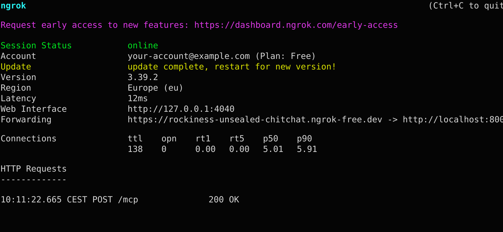

# ChatGPT App: Fidamy Insurance Quote Widget

A ChatGPT Apps SDK widget for comparing Fidamy device-insurance quotes and guiding users from quotation to checkout. The app exposes MCP tools for quoting, preparing the post-selection capture flow, and submitting verified applicant details. The widget renders returned monthly/yearly plans as compact ChatGPT-style cards, then hands the selected package back to chat so the user can complete the purchase flow conversationally.

For broader Apps SDK examples and baseline setup guidance, see the [OpenAI Apps SDK examples README](https://github.com/openai/openai-apps-sdk-examples/blob/main/README.md).

## Overview

This app lets users:

- Request insurance quotes for a supported device category and market value
- Compare monthly and yearly coverage packages
- Expand each package to review covered damage/theft details
- Select a package in the widget
- Continue in chat with receipt-aware instructions for the selected package
- Provide applicant, address, and device details through a guided conversation
- Verify any values extracted from receipt OCR before they are used
- Receive a checkout URL after the purchase intent is created

The frontend is a React widget bundled as static assets. The backend is a Python MCP server built with `FastMCP` that advertises the widget resource and handles the `quote`, `prepare-capture-flow`, and `capture-applicant-values` tool calls.

## Project Structure

```text
chatgpt-app/
├── src/quote/
│   ├── quote.tsx
│   ├── quote.css
│   ├── constants.ts
│   ├── types.ts
│   ├── utils.ts
│   └── components/
├── server/
│   ├── app.py
│   ├── handlers.py
│   ├── main.py
│   ├── mcp_helpers.py
│   ├── schemas.py
│   ├── widgets.py
│   └── services/fidamy_api.py
├── assets/
├── build-all.mts
└── package.json
```

## Prerequisites

- [Node.js 18+](https://nodejs.org/en/download)
- [pnpm](https://pnpm.io/installation)
- [Python 3.10+](https://www.python.org/downloads/)
- Fidamy API credentials in `server/.env`

Verify the tools are installed correctly:

```bash
node --version
pnpm --version
python --version
```

The commands should print versions that meet the requirements above. If your system uses `python3` instead of `python`, run `python3 --version`.

## Install

Install frontend dependencies:

```bash
pnpm install
```

Create the server virtual environment:

```bash
cd server
python -m venv .venv
source .venv/bin/activate
pip install -r requirements.txt
cd ..
```

Create the server environment file from the example:

```bash
cp server/.env.example server/.env
```

Open `server/.env` and fill in the Fidamy values shared in chat. If not, ping Jose.s

## Build And Run Locally

Build the widget assets:

```bash
pnpm build
```

Serve the generated widget files on port `4444`:

```bash
pnpm serve
```

## ChatGPT Connector Setup

For ChatGPT to reach a local server, expose port `8000` with a tunnel such as ngrok:

Create an [ngrok account](https://dashboard.ngrok.com/signup), then log in and connect your local ngrok client with the auth token from your ngrok dashboard:

```bash
ngrok config add-authtoken <your_ngrok_auth_token>
```

Then start the tunnel:

```bash
ngrok http 8000
```



When ngrok starts successfully, it should show `Session Status online` and a `Forwarding` line similar to:

```text
Forwarding  https://rockiness-unsealed-chitchat.ngrok-free.dev -> http://localhost:8000
```

Copy the HTTPS host from that `Forwarding` line. In this example, the custom endpoint is:

```text
rockiness-unsealed-chitchat.ngrok-free.dev
```

This is important for testing because ChatGPT cannot call `localhost` on your machine directly. The ngrok URL gives ChatGPT a public HTTPS endpoint that forwards requests to your local MCP server.

Before starting the Python server, allow the tunnel host for MCP DNS rebinding protection:

```bash
export MCP_ALLOWED_HOSTS="<custom_endpoint>.ngrok-free.app"
export MCP_ALLOWED_ORIGINS="https://<custom_endpoint>.ngrok-free.app"
```

Do not copy the placeholder commands above into the server terminal. Replace `<custom_endpoint>` with the actual HTTPS host from your ngrok `Forwarding` line, then copy and paste those actual-value exports into the same terminal where you will run the MCP server.

Using the screenshot example above, you would copy and paste:

```bash
export MCP_ALLOWED_HOSTS="rockiness-unsealed-chitchat.ngrok-free.dev"
export MCP_ALLOWED_ORIGINS="https://rockiness-unsealed-chitchat.ngrok-free.dev"
```

In the same terminal you pasted the export values, start the MCP server:

```bash
./server/.venv/bin/uvicorn server.main:app --reload --host 0.0.0.0 --port 8000
```

The MCP endpoint locally is:

```text
http://localhost:8000/mcp
```

<!-- The generated `assets/quote.html` loads JS/CSS from `http://localhost:4444` by default. For hosted deployments, build with:

```bash
BASE_URL=https://your-static-assets-host.example pnpm build
``` -->

## Setting up Fidamy App in ChatGPT

Use the MCP server URL from your ngrok forwarding address, with `/mcp` appended to the end. For example:

```text
https://rockiness-unsealed-chitchat.ngrok-free.dev/mcp
```

Then create the app in ChatGPT:

1. Log in to ChatGPT with a paid account.
2. Open **Settings**.
3. In the settings modal, select **Apps**.
4. Under **Advanced settings**, click **Create app**.
5. Enter the following values:
   - **Name**: `Fidamy`
   - **MCP server URL**: your ngrok forwarding URL with `/mcp` appended
   - **OAuth**: `None` for local testing only
6. Confirm that you understand the testing warning.
7. Click **Create**.

## MCP Inspector (for testing mcp server locally)

Start the server, then run:

```bash
npx @modelcontextprotocol/inspector
```

Use:

```text
Transport: Streamable HTTP
URL: http://localhost:8000/mcp
```

You should see:

- Tool: `quote`
- Tool: `prepare-capture-flow`
- Tool: `capture-applicant-values`
- Resource: `ui://widget/quote.html`

Example `quote` input:

```json
{
  "deviceCategory": "Smartphone",
  "deviceMarketValue": 1299
}
```

The Inspector can list/read resources and call tools, but it does not render the full ChatGPT App UI exactly like ChatGPT.

## Tools

### `quote`

Input:

- `deviceCategory`: one of `Smartphone`, `Laptop`, `Smartwatch`, `Wearable`, or `Camera`
- `deviceMarketValue`: current market value of the device

Behavior:

- Calls Fidamy’s quotation endpoint
- Returns structured quotation data for the widget
- Provides the ChatGPT text response with the device category and value
- Attaches `openai/outputTemplate` metadata for `ui://widget/quote.html`
- Can be started from manual device details or from a user-submitted receipt. For receipt-first flows, ChatGPT OCR extracts visible data, shows the captured fields back to the user, and waits for explicit verification or corrections before continuing to quotes, intake questions, or capture.

### `prepare-capture-flow`

Input:

- `deviceCategory`: quoted device category
- `deviceMarketValue`: quoted device market value
- `selectedPlanLabel`: selected insurance plan label
- `selectedBillingPeriod`: selected billing period, either `monthly` or `yearly`
- `selectedPremium`: selected premium amount

Behavior:

- Returns the chat instructions used after a user selects a package in the widget
- Preserves verified receipt OCR values instead of asking for them again
- Tells ChatGPT which missing applicant, address, and device fields to collect
- Keeps the selected plan details attached to the eventual capture call

### `capture-applicant-values`

Input:

- Applicant identity and contact details
- Address
- Device brand/model and serial number or IMEI
- Selected plan details

Behavior:

- Calls Fidamy’s intent endpoint
- Returns a checkout URL for the selected package
- Must only be called after the user has verified all captured data, including any values extracted from receipt OCR.

## User Flow

1. User asks for device insurance or submits a receipt for OCR extraction.
2. If a receipt is submitted, ChatGPT extracts visible fields, shows the captured data back to the user, and stops until the user explicitly verifies or corrects it.
3. ChatGPT calls `quote` once the device category and current market value are available.
4. The widget renders available monthly/yearly packages.
5. User expands package rows to inspect details like fall impact damage, screen breakage, theft, pickpocketing, and robbery.
6. User selects a package.
7. The widget saves the selection with `window.openai.setWidgetState`.
8. The widget calls `prepare-capture-flow` with the selected package and quoted device details.
9. ChatGPT follows the returned instructions to continue the purchase conversation.
10. If verified receipt OCR values already exist, ChatGPT reuses them and asks only for missing or invalid fields.
11. If no receipt values exist, ChatGPT asks whether the user has a receipt, verifies any OCR results, then collects remaining fields one by one.
12. ChatGPT calls `capture-applicant-values` with the verified applicant, address, device, and selected plan details.
13. The server returns a checkout link.

## Notes

- `build-all.mts` currently builds only the `quote` target.
- `useWidgetState` persists selected plan state through the ChatGPT Apps SDK host, not browser `sessionStorage`.
- `LoadingState` uses the same compact list-card visual language as the loaded quote cards.
- The UI palette follows ChatGPT Apps-style light/dark neutral colors with minimal accents.

## Useful Commands

```bash
pnpm build
pnpm serve
pnpm dev
pnpm tsc
./server/.venv/bin/uvicorn server.main:app --reload --host 0.0.0.0 --port 8000
```

## License

This project is licensed under the MIT License. See [LICENSE](./LICENSE) for details.
